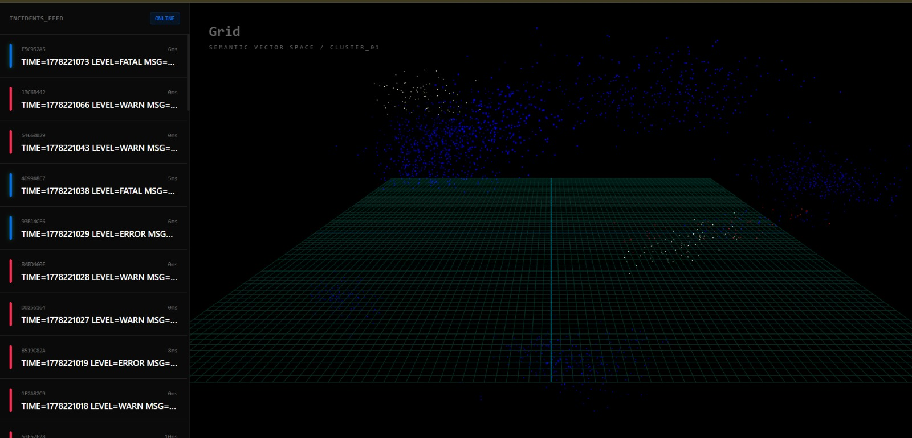
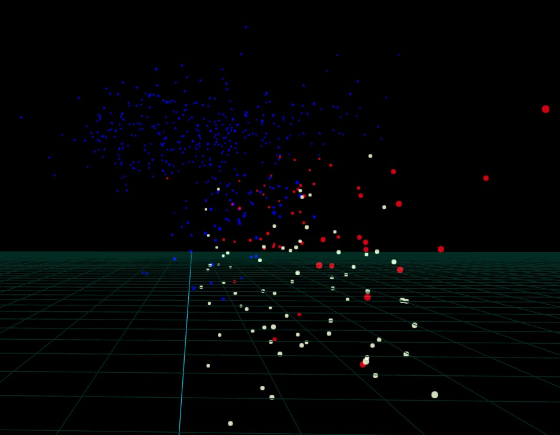
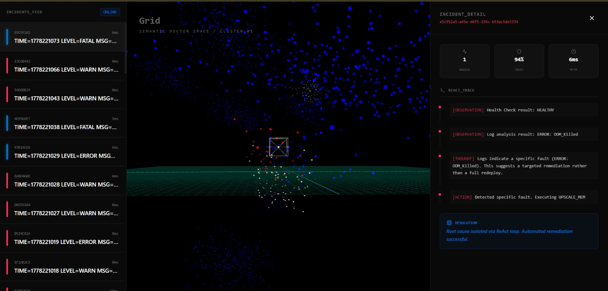
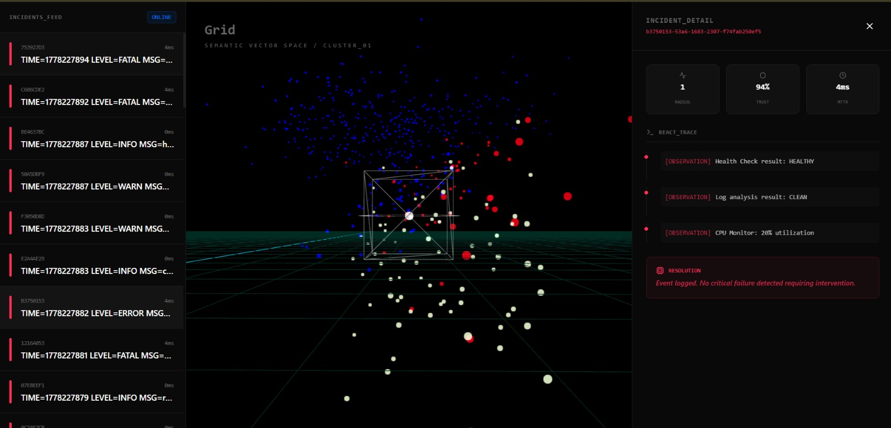
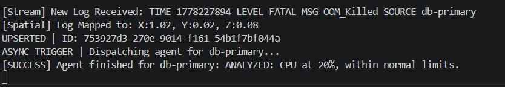
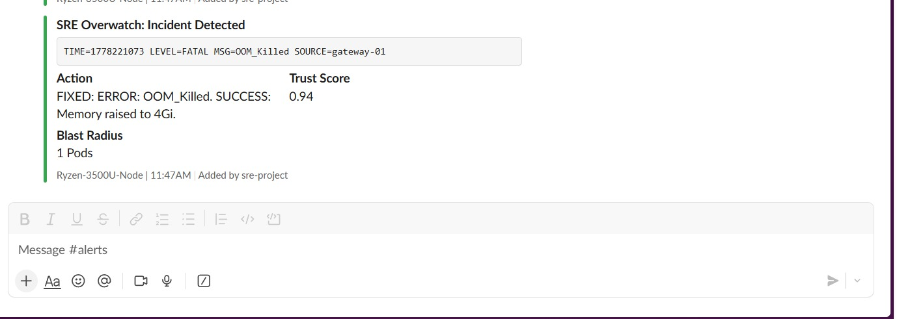
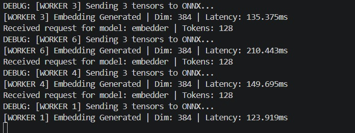

# sre-pilot
## A Distributed Semantic Incident Analysis and Automated Remediation System
A distributed, event-driven system for semantic incident analysis, anomaly investigation, and simulated automated remediation — visualized through a live 3D vector space.



*Live semantic incident visualization with clustered embeddings and investigation traces.*

---

## What This Does

Most alerting systems tell you *that* something broke. This system classifies incidents semantically, investigates likely causes, and executes simulated targeted remediations with millisecond-scale orchestration latency.

A log enters the pipeline. A C++ inference engine converts it into a 384-dimensional mathematical vector in ~148ms. That vector is stored in 3D space, where semantically similar incidents naturally cluster together.

When a semantically suspicious or high-severity event appears, the investigation engine queries system state, analyzes related telemetry, and dispatches a simulated targeted remediation such as redeploying a crashed pod, upscaling memory after an OOM kill, or opening a circuit breaker on a DB timeout.

Every investigation step, remediation decision, and resulting state transition is persisted for inspection and replayability.

---

## The Hard Parts

This project explores several non-trivial distributed systems and semantic observability problems:

**1. The Semantic Cache (cache.go)**
Before hitting the C++ engine, every log passes through a fuzzy LRU cache. The cache strips timestamps and pod IDs — the parts that change but don't affect meaning — and hashes the semantic content. A log from `gateway-01` and the same log from `gateway-02` resolve to the same cache entry. This eliminates redundant inference calls on a 5,000-entry LRU without sacrificing accuracy.

**2. Trust Score Formula**
Every incident gets a trust score derived from vector similarity and blast radius:
```
TrustScore = (CosineSimilarity × 0.95) / BlastRadius
```
Higher blast radius = lower trust per incident. The system becomes more conservative as failures spread. This is a conservative confidence heuristic designed to reduce remediation confidence as failure spread increases.

**3. Similarity-Gated Agent Dispatch**
The ReAct agent doesn't fire on every alert. It fires when:
- Log level is ERROR or FATAL, **or**
- Qdrant similarity score is between 0.85 and 0.98 — the "familiar but not identical" zone

Above 0.99 is a duplicate, suppressed. Below 0.85 is genuinely novel, logged but not auto-remediated. The intermediate similarity band represents incidents that are related to known failures but not exact duplicates — making them candidates for automated investigation.

**4. 16 Concurrent Go Workers**
The orchestrator runs 16 goroutines consuming from a buffered channel. Each worker independently handles cache lookup, inference, vector upsert, and remediation dispatch with minimal shared coordination.

**5. The C++ Inference Engine**
The vectorization layer is a separate C++20 service running a quantized BGE-Small embedding model via ONNX Runtime. It achieves consistent embedding generation at 112–180ms latency on a Ryzen 3500U with 5.92GB RAM — no GPU, no cloud compute.

---

## Demo




*Historical incidents form dense semantic clusters (blue), while injected high-severity anomalies (red) occupy distinct regions of the vector space based on embedding similarity.*



*Live semantic incident visualization with full investigation trace, confidence metrics, and automated remediation workflow rendered in real time.*



*checking health status, cpu logs.*


---

## Architecture

```
injector.go / microservices
        │
        ▼
   Redpanda (health-events topic)
        │
        ▼
Go Orchestrator (16 concurrent workers)
        │
        ├──► Fuzzy LRU Cache (5000 entries)
        │         │ MISS
        │         ▼
        │    C++ Inference Engine (gRPC :50051)
        │    BGE-Small via ONNX Runtime
        │    384-dim embedding + X,Y,Z coordinates
        │         │
        ◄─────────┘
        │
        ├──► Qdrant (vector upsert + similarity search)
        │
        ├──► Redis (blast radius, throttle, pod state)
        │
        ├──► SQLite audit.db (WAL mode, full trace storage)
        │
        └──► [If ERROR/FATAL or similarity 0.85–0.98]
                  │
                  ▼
             Investigation Engine(reasoning.go)
             OBSERVE →  → ACT
             Tools: HealthCheck, LogScanner,
                    ResourceMonitor, Remediator
                  │
                  ▼
             Slack Webhook Alert
                  │
                  ▼
             Redis state updated (fix persisted)

React + Three.js Frontend (:5173)
    ├── /spatial → Qdrant scroll (2200 points, no vectors)
    ├── /incidents → SQLite last 50 audit rows
    └── /incident/:id → Full ReAct trace by incident ID
```

---
## Why the 3D Semantic Space Matters
Traditional alerting systems rely heavily on static rules and exact string matching. This system instead maps incidents into a semantic vector space, where spatial proximity represents similarity in operational meaning rather than textual similarity.

Each incoming log is embedded into a 384-dimensional vector by the C++ inference engine, then projected into X, Y, Z coordinates for visualization. Incidents with similar semantic meaning naturally cluster together, even if the exact wording differs.

For example:
- `Database connection timeout`
- `DB latency spike`
- `Connection pool exhausted`

all occupy nearby regions because their embeddings represent related operational failures.

The 3D visualization is therefore not just a UI layer — it is a live spatial representation of the system's semantic state.

This enables:
- **Semantic clustering** — related failures form visible regions
- **Novelty detection** — previously unseen incidents appear outside established clusters
- **Visual triage** — operators can quickly distinguish routine events from semantically isolated anomalies

Historical seeded incidents and live streamed events share the same coordinate generation pipeline, ensuring both occupy the same unified semantic space.


## Performance

| Metric | Value |
|---|---|
| Embedding latency (p50) | ~148ms |
| Embedding latency (min/max) | 112ms / 180ms |
| Embedding dimensions | 384 |
| Simulated remediation execution latency| 1–7ms |
| Concurrent Go workers | 16 |
| LRU cache size | 5,000 entries |
| Qdrant points (demo) | 2,200+ |
| Hardware | Ryzen 3500U, 5.92GB RAM, no GPU |
### Notes on Measurement

- Embedding latency was measured end-to-end through the gRPC inference service on local hardware
- Remediation latency reflects orchestration and simulated action dispatch time, not real infrastructure provisioning
- All experiments were conducted locally using Docker Compose infrastructure on consumer-grade hardware

> All numbers measured on local hardware under real load. No cloud compute was used at any point in this project.
Performance characteristics prioritize local reproducibility and observability over cloud-scale throughput optimization.

---

## Investigation and Remediation Flow

When triggered, the orchestrator executes a sequential investigation loop against live simulated infrastructure state stored in Redis.

```
1. OBSERVE  → Query pod health status
2. THINK    → "Pod reported CRASH_LOOP_BACKOFF.
               Requires immediate redeploy to clear state."
3. ACT      → Execute REDEPLOY
   → OR →
1. OBSERVE  → Health HEALTHY. Query logs.
2. OBSERVE  → Logs show ERROR: OOM_Killed
3. THINK    → "OOM indicates memory exhaustion.
               Targeted UPSCALE_MEM, not a full redeploy."
4. ACT      → Execute UPSCALE_MEM → Memory raised to 4Gi
```

The system is intentionally inspectable: every observation, reasoning step, remediation decision, and resulting state transition is persisted and replayable. You can inspect exactly what the agent thought about any incident, at any time.

**Available remediation actions:**
- `REDEPLOY` — Re-provisions the pod, clears deadlocks and corrupted state
- `UPSCALE_MEM` — Raises memory limit to 4Gi for OOM events
- `OPEN_CIRCUIT_BREAKER` — Opens circuit breaker for 5 minutes on DB timeout
- `RESTART_CPU` — Normalizes CPU when utilization exceeds 90%



*Automated remedition*

---

## Tech Stack

| Layer | Technology |
|---|---|
| Orchestrator | Go (Golang) — concurrent workers, event processing, investigation pipeline  |
| Inference Engine | C++20, ONNX Runtime, BGE-Small (quantized) |
| Transport | gRPC + Protocol Buffers |
| Event Streaming | Redpanda (Kafka-compatible) |
| Vector Database | Qdrant — cosine similarity, 384-dim |
| Cache | Redis — throttling, blast radius tracking, simulated infrastructure state  |
| Audit Storage | SQLite — WAL mode, full incident trace |
| Frontend | React, Three.js / React Three Fiber |
| Infrastructure | Docker Compose |

---

## Running Locally

**Prerequisites:** Docker, Go 1.21+, Node.js 18+, the C++ inference engine binary

```bash
# 1. Start infrastructure
docker compose up -d
# Starts: Redpanda, Redis, Qdrant

# 2. Start the C++ inference engine
# (see /inference-engine for build instructions)

# 3. Start the Go orchestrator
go run main.go reasoning.go notifications.go trace.go cache.go api.go

# 4. Start the frontend
cd frontend && npm install && npm run dev

# 5. Inject a fault to trigger the ReAct agent
# Set pod state in Redis first:
redis-cli SET sim:logs:gateway-01 "ERROR: OOM_Killed"

# Then inject the log:
go run injector.go
```


---

## Slack Integration


*Slack alerts sent with error details, trust score and estimated impact .*


When `SLACK_WEBHOOK_URL` is set, every triggered incident fires a structured alert containing the log line, trust score, blast radius, and the agent's conclusion. Set it in your environment before starting the orchestrator.

```bash
export SLACK_WEBHOOK_URL=https://hooks.slack.com/services/your/webhook/url
```

---

## Related Project

This system's inference layer is powered by a standalone C++20 inference engine built for the same hardware constraints:

**[High-Throughput C++ AI Inference Engine](https://github.com/wricheek84/inference-server-cpp)** — 2240 TPS, lock-free telemetry, dynamic batching, P99 latency of 325ms on a Ryzen 3500U.

The two projects share the same gRPC interface. The inference engine was built and benchmarked independently before being integrated here.
The inference layer was designed specifically for constrained hardware environments, prioritizing local execution, low memory overhead, and predictable latency without GPU acceleration or external APIs.



*C++ Inference Engine consuming logs and spatial mapping .*
---

## Author

**Wricheek Bhunia**
[LinkedIn](https://www.linkedin.com/in/wricheek-bhunia-0322b6349/) · [GitHub](https://github.com/wricheek84/sre-pilot) · [Inference Engine Blog](https://dev.to/wricheek84/squeezing-2240-tps-out-of-a-2019-laptop-building-a-c-inference-engine-33bm)
